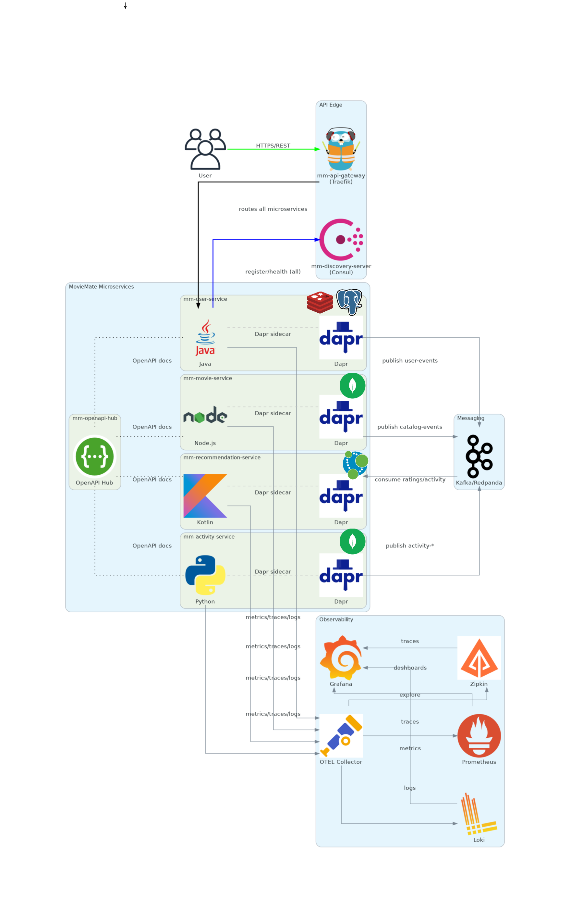

# 🎬 Movie Mate

> *App for movie recommendations, user insights, and cutting-edge microservices tech.*

---

**Movie Mate** is a full-stack, containerized, microservices architecture built for real-time movie recommendations and system observability at scale.

---

## 🏗️ System Overview

---

## 🔍 What’s inside?

| Layer             | Tech Stack 🧰                                                                |
|-------------------|------------------------------------------------------------------------------|
| **Frontend**      | (Coming soon...) React                                                       |
| **API Gateway**   | Traefik with Consul Service Discovery                                        |
| **Microservices** | Polyglot architecture                                                        |
| **Communication** | Dapr Sidecar + Kafka + REST APIs                                             |
| **Databases**     | PostgreSQL, MongoDB, Redis, Neo4j                                            |
| **Observability** | Prometheus, Loki, Zipkin, OpenTelemetry, Grafana                             |
| **Message Bus**   | Kafka + Dapr Pub/Sub                                                         |
| **CI/CD**         | GitHub Actions + Docker                                                      |
| **Security**      | JWT-based auth                                                               |
| **Documentation** | OpenAPI                                                                      |

---

## 🧠 Microservices

| Service                   | Description                                                  |
|---------------------------|--------------------------------------------------------------|
| `mm-user-service`         | Manages users, authentication                                |
| `mm-movie-service`        | Stores movies, metadata, genres                              |
| `mm-recommendation-service`| Recommendation logic based on user activity                 |
| `mm-activity-service`     | Tracks user actions across services                          |
| `mm-api-gateway`          | Single entrypoint with routing, auth, and rate limiting      |
| `mm-discovery-server`     | Service registration and discovery using Consul              |

---

## 🌐 Observability First

Everything is observable out of the box. Metrics, traces, and logs in real time using:

- 📈 **Prometheus**: Metrics collection
- 🧠 **Grafana**: Unified dashboards
- 🔍 **Loki**: Log aggregation
- 🛰️ **Zipkin**: Distributed tracing
- 📡 **OpenTelemetry Collector**: Unified observability pipeline

