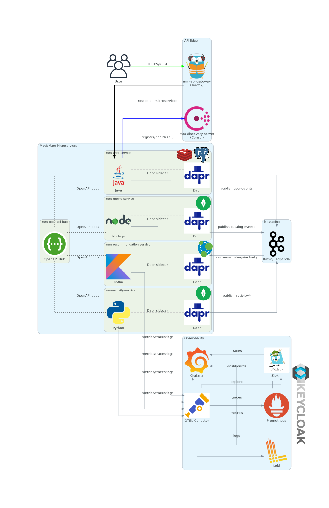
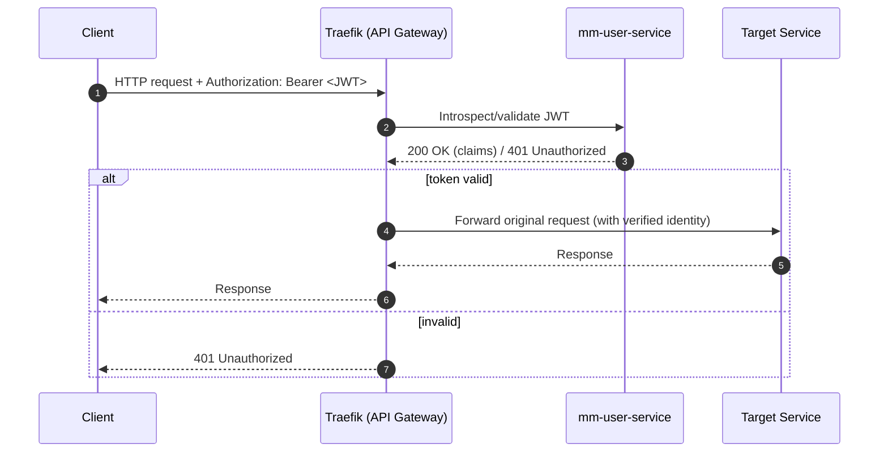

# 🎬 Movie Mate

> *App for movie recommendations, user insights, and cutting-edge microservices tech.*

---

> **Movie Mate** is a full-stack, polyglot platform that delivers personalised movie recommendations with **Dapr sidecars**, **Kafka**, and **end-to-end observability**.  
> Deployed on **Kubernetes** (k3s or full k8s). _Security first_ via **JWT** at the edge.
---

## 🔎 Table of Contents
1. 🏗️ [System Overview](#️-system-overview)
2. 📚 [Tech Stack](#-tech-stack)
3. 🧠 [Microservices](#-microservices)
4. 🛠️ [Platform & Utilities](#-platform--utilities)
5. 🔒 [JWT Auth Flow](#-jwt-auth-flow)
6. 🌐 [Observability](#-observability-first)
7. 🗺️ [Roadmap](#-roadmap)

---

## 🏗️ System Overview

---

## 📚 Tech Stack
| Layer | Tech                                                 |
|---|------------------------------------------------------|
| **Frontend** | React, TypeScript, Next.js, Tailwind                 |
| **API Gateway** | Traefik + Consul (service discovery)                 |
| **Microservices** | Java • Node.js • Kotlin • Python                     |
| **Communication** | Dapr Sidecars • Kafka Pub/Sub • REST                 |
| **Databases** | PostgreSQL • MongoDB • Redis • Neo4j                 |
| **Observability** | Prometheus • Loki • Zipkin • OpenTelemetry • Grafana |
| **CI/CD** | GitHub Actions • Docker                              |
| **Platform** | **Kubernetes** (k3s)                                 |
| **Security** | JWT (validated by User Service via API Gateway)      |
| **Docs** | OpenAPI (aggregated in **mm-openapi-hub**)           |

---

## 🧠 Microservices
| Service                                                                                       | Purpose                                                    | Tech                                                                                                                                      |
| --------------------------------------------------------------------------------------------- | ---------------------------------------------------------- | ----------------------------------------------------------------------------------------------------------------------------------------- |
| [`mm-user-service`](https://github.com/mankis-movie-mate/mm-user-service)                     | Users & authentication                                     |   |
| [`mm-movie-service`](https://github.com/mankis-movie-mate/mm-movie-service)                   | Movies, genres, metadata                                   |                                                                   |
| [`mm-recommendation-service`](https://github.com/mankis-movie-mate/mm-recommendation-service) | Recommendation engine (consumes activity & catalog events) |                                                                  |
| [`mm-activity-service`](https://github.com/mankis-movie-mate/mm-activity-service)             | Tracks user actions across services                        |                                                                     |
| [`mm-api-gateway`](https://github.com/mankis-movie-mate/mm-api-gateway)                       | Single entrypoint; routing & rate limits                   |                                                          |
| [`mm-discovery-server`](https://github.com/mankis-movie-mate/mm-discovery-server)             | Service registration & discovery (Consul)                  |                                                                   |

---

## 🛠️ Platform & Utilities
| Repo                                                                          | Description                                   | Tech                                                                                                                                                                        |
|-------------------------------------------------------------------------------|-----------------------------------------------|-----------------------------------------------------------------------------------------------------------------------------------------------------------------------------|
| [`mm-app-view`](https://github.com/mankis-movie-mate/mm-infrastructure)       | Frontend                                      |                                    |
| [`mm-infrastructure`](https://github.com/mankis-movie-mate/mm-infrastructure) | IaC, manifests, CI/CD pipeline for deployment |   |
| [`mm-openapi-hub`](https://github.com/mankis-movie-mate/mm-openapi-hub)       | Centralised Swagger UI for all services       |                                                                                               |

## 🔒 JWT Auth Flow

> **One way in**: the API Gateway is your bouncer; **User Service** is the ID checker.

## 🌐 Observability First

Everything is observable out of the box. Metrics, traces, and logs in real time using:

- 📈 **Prometheus**: Metrics collection
- 🧠 **Grafana**: Unified dashboards
- 🔍 **Loki**: Log aggregation
- 🛰️ **Zipkin**: Distributed tracing
- 📡 **OpenTelemetry Collector**: Unified observability pipeline

## 🗺️ Roadmap

Planned and upcoming features for **Movie Mate** — both for dev experience and user functionality:

### 🎯 Core Features
- 🖼️ **Frontend App**: React + Next.js SPA for browsing movies and managing account
- 🔐 **RBAC & Multi-tenancy**: Role-based access control 
- 🚩 **Feature Flags**: Fine-grained control with [Unleash](https://www.getunleash.io/) for toggling features live
- ✅ **End-to-End Testing**: CI-based tests using [KinD](https://kind.sigs.k8s.io/) + GitHub Actions for full cluster testing

### 🚀 DevOps / Platform
- 🌀 **Canary Releases**: Progressive delivery with [Argo Rollouts](https://argoproj.github.io/argo-rollouts/)
- 🔍 **Zero-Downtime Observability**: Auto instrument new services with OTEL SDKs